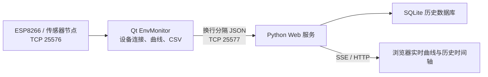

# 环境数据采集系统技术文档

> 文档版本：1.3  
> 更新日期：2026-06-10  
> 项目路径：`D:\2026xiaoxueqi\260608\ProJect\sjk`

## 1. 项目概述

本项目用于采集和展示环境温度、湿度、光照数据，由 ESP8266、Qt 桌面上位机和 Python Web 服务组成。

Qt 上位机是系统的数据中心，独占连接 ESP8266。Python 服务不直接连接设备，只订阅 Qt 广播的数据并提供浏览器访问。



## 2. 目录结构

```text
sjk/
├─ upper_computer/              Qt 桌面上位机
│  ├─ src/
│  │  ├─ main.cpp              程序入口
│  │  ├─ mainwindow.*          模块组织和数据流
│  │  ├─ tcpclient.*           ESP8266 TCP 客户端
│  │  ├─ dataparser.*          JSON、串口文本解析
│  │  ├─ dashboard.*           实时数值卡片
│  │  ├─ chartview.*           双轴实时曲线
│  │  ├─ datastore.*           CSV 数据记录
│  │  ├─ devicepanel.*         设备连接面板
│  │  └─ databridgeserver.*    Qt 到 Python 的数据广播服务
│  ├─ build/                   CMake 构建目录
│  ├─ deploy/                  可直接运行的部署目录
│  └─ CMakeLists.txt
├─ web/
│  ├─ server.py                Qt 数据订阅、HTTP、SSE 服务
│  ├─ index.html               浏览器监控页面
│  └─ data/sensor.db           SQLite 历史数据库（运行后生成）
└─ 技术文档.md
```

## 3. 技术栈

### 3.1 Qt 上位机

- C++17
- Qt 6.11.1
- Qt Widgets
- Qt Charts
- Qt Network
- CMake 3.30
- Ninja
- MinGW 13.1

### 3.2 Web 服务

- Python 3
- Python 标准库 HTTP Server
- TCP Socket
- SQLite 3
- Server-Sent Events（SSE）
- 原生 HTML、CSS、JavaScript
- Canvas 实时曲线

## 4. 端口定义

| 端口 | 服务端 | 客户端 | 用途 |
|---|---|---|---|
| `25576` | ESP8266 | Qt | 原始传感器 JSON |
| `25577` | Qt | Python | 共享设备状态和传感器数据 |
| `8080` | Python | 浏览器 | Web 页面、API 和 SSE |

Python 不应直接连接 `25576`。ESP8266 的连接、扫描、断开和自动重连均由 Qt 管理。

## 5. 数据流

1. Qt 通过 `QTcpSocket` 连接 ESP8266 的 `25576` 端口。
2. `TcpClient` 从连续 TCP 字节流中提取完整 JSON 对象。
3. `DataParser` 将 JSON 转换为 `SensorData`。
4. `MainWindow` 将数据分发到：
   - `Dashboard`：更新温度、湿度、光照卡片。
   - `ChartView`：更新实时曲线。
   - `DataStore`：写入 CSV。
   - `DataBridgeServer`：广播给 Python。
5. Python 连接 Qt 的 `25577` 端口并持续读取换行分隔 JSON。
6. Python 将完整传感器数据写入 SQLite。
7. Python 通过 SSE 将同一份实时数据推送给浏览器。
8. 浏览器可通过二级菜单查询历史数据时间轴。

## 6. 通信协议

### 6.1 ESP8266 到 Qt

ESP8266 可以连续发送 JSON，不强制使用换行：

```json
{"temp":25.4,"humi":48.0,"light":63}
```

Qt 使用大括号深度匹配，从 TCP 流中拆分 JSON 对象。

### 6.2 Qt 到 Python

Qt 使用 UTF-8 换行分隔 JSON，每条消息以 `\n` 结束。

设备状态：

```json
{"type":"status","connected":true,"host":"192.168.1.100","status":"已连接 192.168.1.100:25576","error":""}
```

传感器数据：

```json
{"type":"sensor","temp":25.4,"humi":48.0,"light":63,"timestamp":1781060000000}
```

Python 连接 Qt 后，Qt 会立即发送最新状态；存在历史传感器快照时，也会立即发送最新数据。

## 7. Qt 模块说明

### 7.1 `TcpClient`

- 连接 ESP8266 `25576`。
- 异常断开后每 3 秒自动重连。
- 手动断开时停止重连。
- 支持局域网设备扫描。
- 负责连续 JSON 拆包。

### 7.2 `DataParser`

- 解析 ESP8266 JSON。
- 保留串口文本解析能力。
- 输出统一的 `SensorData`。

### 7.3 `Dashboard`

显示：

- 温度，单位 `°C`
- 湿度，单位 `%RH`
- 光照，单位 `%`
- 当前设备连接状态

### 7.4 `ChartView`

Qt 曲线与 Web 曲线采用相同的核心设计：

- 橙色：温度
- 青色：湿度
- 黄色：光照
- 最近 60 个采样点
- 温度使用左 Y 轴，并根据最近数据自动缩放
- 湿度和光照使用右 Y 轴，固定范围 `0–100`
- X 轴显示实际采样时间
- 支持“暂停/继续”
- 支持“清空”
- 无数据时显示“等待传感器数据...”

“暂停”只暂停曲线追加，不影响数值卡片、CSV 记录和 Web 数据共享。

### 7.5 `DataStore`

设备连接成功后自动创建 CSV：

```text
data/sensor_YYYYMMDD_HHMMSS.csv
```

格式：

```csv
timestamp,temp,humi,light
2026-06-10 10:30:17,24.9,19,64
```

设备断开后停止当前文件记录，再次连接会创建新的 CSV 文件。

### 7.6 `DataBridgeServer`

- 在 `0.0.0.0:25577` 监听。
- 支持多个 Python 或其他只读客户端。
- 广播设备连接状态和完整传感器数据。
- 客户端稍后连接时可获得当前状态和最新数据。

## 8. Python Web 服务

Python 是 Qt 的下游订阅者，不负责连接 ESP8266。

### 8.1 HTTP 接口

| 接口 | 说明 |
|---|---|
| `GET /` | 监控页面 |
| `GET /data` | SSE 实时事件流 |
| `GET /api/status` | Qt、设备和传感器当前状态 |
| `GET /api/connect?host=IP` | 连接指定 Qt 数据服务 |
| `GET /api/auto_connect` | 搜索 Qt `25577` 服务 |
| `GET /api/disconnect` | 断开 Python 与 Qt 的连接 |
| `GET /api/history?start=毫秒&end=毫秒&limit=1200` | 查询历史数据 |
| `GET /api/history/stats` | 查询数据库记录数量和时间范围 |

调用 `/api/disconnect` 不会断开 Qt 与 ESP8266。

### 8.2 SSE 事件

- `status`：Qt 数据服务和设备状态
- `data`：温度、湿度、光照
- `ping`：保持 SSE 长连接

### 8.3 SQLite 数据库

数据库文件：

```text
web/data/sensor.db
```

Python 使用 SQLite WAL 模式，表结构如下：

```sql
CREATE TABLE sensor_readings (
    id INTEGER PRIMARY KEY AUTOINCREMENT,
    recorded_at INTEGER NOT NULL UNIQUE,
    temp REAL,
    humi REAL,
    light INTEGER,
    source_host TEXT NOT NULL DEFAULT ''
);
```

字段说明：

| 字段 | 说明 |
|---|---|
| `recorded_at` | Qt 采样时间，Unix 毫秒时间戳 |
| `temp` | 温度 |
| `humi` | 湿度 |
| `light` | 光照百分比 |
| `source_host` | Qt 当前连接的 ESP8266 IP |

`recorded_at` 使用唯一约束。Python 与 Qt 重连时，Qt 可能重新发送最近快照，数据库会通过 `INSERT OR IGNORE` 避免重复记录。

历史查询最多允许返回 5000 个点。查询结果超过限制时，服务器按照实际数据时间跨度自动分桶，返回每个时间桶的平均值，避免长时间范围拖慢浏览器。

### 8.4 Web 页面结构

Web 页面通过顶部导航分为两个视图：

- **实时监控首页**：显示 Qt 连接面板、温湿度与光照数值卡片、实时传感器曲线和运行日志。
- **历史记录二级菜单**：根据时间范围读取 SQLite，并按时间轴展示记录。

历史时间轴支持：

- 最近 1 小时、6 小时、24 小时、7 天快捷范围。
- 自定义开始时间和结束时间。
- 按时间倒序显示温度、湿度和光照。
- 每次显示 100 条，可继续加载更多。
- 数据量过大时显示服务器降采样说明。

历史查询不影响 Qt 采集、CSV 记录、SQLite 入库或首页实时曲线。

## 9. 构建 Qt 工程

在 PowerShell 中执行：

```powershell
cd D:\2026xiaoxueqi\260608\ProJect\sjk\upper_computer

& C:\Qt\Tools\CMake_64\bin\cmake.exe --fresh `
  -S . `
  -B build `
  -G Ninja `
  -DCMAKE_BUILD_TYPE=Release `
  -DCMAKE_PREFIX_PATH=C:\Qt\6.11.1\mingw_64 `
  -DCMAKE_MAKE_PROGRAM=C:\Qt\Tools\Ninja\ninja.exe `
  -DCMAKE_CXX_COMPILER=C:\Qt\Tools\mingw1310_64\bin\g++.exe

& C:\Qt\Tools\CMake_64\bin\cmake.exe --build build
```

构建产物：

```text
upper_computer/build/EnvMonitor.exe
```

部署程序：

```text
upper_computer/deploy/EnvMonitor.exe
```

## 10. 运行方式

### 10.1 启动 Qt

直接启动：

```powershell
cd D:\2026xiaoxueqi\260608\ProJect\sjk\upper_computer\deploy
.\EnvMonitor.exe
```

然后在 Qt 界面输入 ESP8266 IP，或使用自动扫描。

也可以通过命令行自动连接：

```powershell
.\EnvMonitor.exe 192.168.1.100
```

### 10.2 启动 Web 服务

Qt 和 Python 在同一台电脑：

```powershell
cd D:\2026xiaoxueqi\260608\ProJect\sjk\web
python server.py
```

Qt 位于另一台电脑：

```powershell
python server.py 192.168.1.20
```

自定义端口：

```powershell
python server.py 127.0.0.1 --port 8080 --qt-port 25577
```

浏览器访问：

```text
http://localhost:8080
```

Python 可以先于 Qt 启动。Qt 尚未启动时，Python 会每 3 秒尝试重连。

SQLite 数据库会在 Python 首次启动时自动创建，不需要安装额外数据库服务。

## 11. 推荐启动顺序

1. 关闭可能影响局域网访问的 Clash/TUN。
2. 确认 ESP8266 和电脑位于同一局域网。
3. 启动 Qt 上位机。
4. 在 Qt 中连接 ESP8266。
5. 启动 Python Web 服务。
6. 打开浏览器页面。

## 12. 故障排查

### 12.1 Qt 找不到 ESP8266

- 确认 ESP8266 正在监听 `25576`。
- 确认电脑和 ESP8266 位于同一网段。
- 暂时关闭 Clash/TUN、VPN 和防火墙后测试。
- 直接输入 ESP8266 IP，避免依赖扫描。

### 12.2 Python 无法连接 Qt

检查 Qt 是否监听：

```powershell
Get-NetTCPConnection -LocalPort 25577 -State Listen
```

检查端口：

```powershell
Test-NetConnection 127.0.0.1 -Port 25577
```

如果 Qt 在另一台电脑，需要允许 Windows 防火墙入站访问 `25577`。

### 12.3 Web 有状态但没有曲线

- 确认 Qt 数值卡片正在变化。
- 查看 `/api/status` 中的 `sensor` 字段。
- 刷新浏览器并检查 SSE 是否成功连接。
- 确认曲线未处于暂停状态。

### 12.4 历史查询没有数据

- 确认 `web/data/sensor.db` 已生成。
- 调用 `http://localhost:8080/api/history/stats` 检查记录数量。
- 确认所选时间范围覆盖真实采样时间。
- 确认 Qt 正在向 Python 广播完整的 `sensor` 消息。

备份历史数据时，应复制以下文件：

```text
web/data/sensor.db
web/data/sensor.db-wal
web/data/sensor.db-shm
```

更稳妥的方式是在停止 Python 服务后复制 `sensor.db`。

### 12.4 Qt 能运行但构建失败

项目移动后，旧的 `CMakeCache.txt` 可能保存旧路径。使用第 9 节中的 `--fresh` 命令重新生成构建目录。

## 13. 当前限制

- Qt 串口解析代码尚未接入主数据链路。
- ESP8266 设备身份通过端口判断，未实现握手校验。
- CSV 没有自动归档和容量限制。
- SQLite 当前没有自动归档和保留期限。
- 当前使用 SQLite；如部署为多服务器写入，可再迁移到 MySQL。
- 设备 JSON 缺少某个字段时，需要进一步完善“部分数据合并”策略。

## 14. 文档维护方法

代码发生以下变化时，应同步更新本文档：

1. 修改端口或通信协议。
2. 新增或删除 Qt 模块。
3. 修改启动参数。
4. 修改 CSV 格式。
5. 修改曲线点数、坐标轴或交互。
6. 新增数据库、历史查询或设备控制功能。
7. 修改数据库表结构、历史 API 或回放策略。

建议每次发布前执行：

```powershell
python -m py_compile web\server.py
& C:\Qt\Tools\CMake_64\bin\cmake.exe --build upper_computer\build
```

并人工验证：

- Qt 能连接 ESP8266。
- Qt 曲线和 CSV 正常。
- Qt 正在监听 `25577`。
- Python 只连接 Qt，不连接 ESP8266。
- Web 数值、曲线和连接状态正常。
- SQLite 持续写入且重连不会产生重复时间戳。
- Web 首页连接面板、实时数值卡片、实时曲线和运行日志正常。
- 历史二级菜单、时间筛选和时间轴加载正常。
